# 情感分析：实验报告

> 陈鑫圣&emsp;计算机科学与技术系 计13&emsp;2021010760

***

<!-- 
1）	模型的结构图，以及流程分析。
2）	实验结果，准确率，F-score标的实验效果。
3）	试简要地比较实验中使用的不同参数效果，并分析原因。
4）	比较baseline模型与CNN，RNN模型的效果差异。（如果有实现）
5）	问题思考
6）	心得体会
-->

本次实验实现了 CNN，LSTM，GRU，MLP 四种模型。程序运行方式和文件结构简要介绍参见 `README.md` 。

## 模型结构与流程分析

### 预处理

将训练集、验证集的所有词语读入，并从 1 开始编号，生成一个“词汇-词id”表（对应的预处理函数是 `data_preprocess.py` 的 `gen_word2id` 函数）。

基于以上的“词汇-词id”表，和预训练好的词向量，并生成一个“词id-词向量”表（对应的预处理函数是 `data_preprocess.py` 的 `gen_id2vec` 函数）。

基于以上的“词汇-词id”表，将训练集、验证集、测试集的所有句子读入，并将每个句子转化为一个由词 id 组成的列表（对应的预处理函数是 `data_preprocess.py` 的 `text2id` 函数）。

### CNN

本次实验实现的 CNN 结构参照了课堂讲解的 TextCNN。具体结构如下。

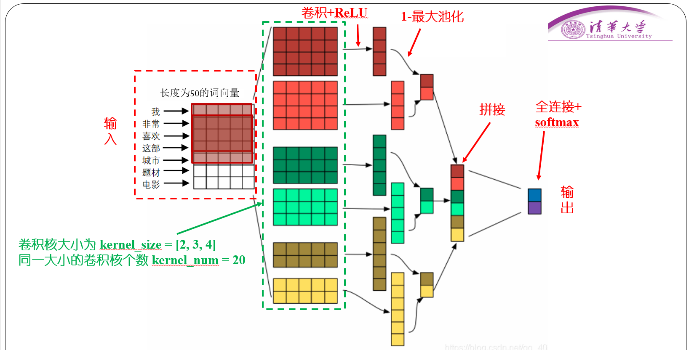

它依次有如下几层。

1. 嵌入层。将每个句子（输入为一个 `id` 数组，每一项表示每个词语的 `id`）转化成对应的词向量序列。
2. 卷积层 + ReLU。有 3 种不同大小的卷积核，大小由 `kernel_sizes` 指定，默认值在 `config.py` 中指定 `KERNEL_SIZES` 。每种卷积核的数量为 `config.kernel_num` ，默认是 `KERNEL_NUM` 。
3. 池化层 + 连接 + Dropout。将每个卷积核输出的张量进行最大池化，得到 1 个“标量”。再将所有“标量”连接，然后随机将一些神经元丢弃。
4. 全连接层 + softmax。将上一步拼接得到的张量通过一个线性层映射到一个长度为 2 的张量上，再进行 softmax，所得结果表示正情感和负情感的概率。

### LSTM(RNN)

本次实验实现的 LSTM 结构参照了课堂讲解的 LSTM。

它依次有如下几层。

1. 嵌入层。将每个句子转化成对应的词向量序列。同上。
2. LSTM 层 + 连接 + Dropout。本次实验实现了双向、多层 LSTM。对 LSTM 的最终状态 `h_n` ，取最后一层的结果（如果有两个方向的话，再将两个方向的结果拼接在一起）。单项单层 LSTM 的结构如下。

			<!--块级封装-->
    
	<!--将图片和文字居中-->
    
     		<!--换行-->
    

1. 线性层。将上一步拼接得到的张量通过一个线性层映射到一个长度为 2 的张量上。

### GRU(RNN)

GRU 的结构与 LSTM 类似，只是每个“细胞”单元不同。GRU 的“细胞”结构如下所示。

			<!--块级封装-->
    
	<!--将图片和文字居中-->
    
     		<!--换行-->
    

除了“细胞”结构不同之外，其它各层结构均与以上 LSTM 相同，这里不再赘述。

### MLP

本次实验实现了全连接神经网络（MLP）作为 baseline。其大致结构示意图如下。

			<!--块级封装-->
    
	<!--将图片和文字居中-->
    
     		<!--换行-->
    

它依次有如下几层。

1. 嵌入层。将每个句子转化成对应的词向量序列。同上。
2. 全连接层 1 + ReLU 。将整个句子的各个词语的词向量依次拼接，通过全连接层 1 和 ReLU 函数映射成 `hidden_size` 的张量。
3. Dropout 层。对上一层得到的张量，随机丢弃一些元素。
4. 全连接层 2 + ReLU 。对 Dropout 层得到的张量，通过一个全连接层映射到一个长度为 2 的张量上。

## 实验结果

各个模型的结果如下。对于每个模型，分别选取用该模型测试时，使得测试集的 F1-score 最大的参数和 epoch 对应的结果。对应参数见下图。

|           | Accuracy | F1-score |
| :-------: | :------: | :------: |
|    CNN    |  0.8726  |  0.8712  |
| LSTM(RNN) |  0.8428  |  0.8497  |
| GRU(RNN)  |  0.8347  |  0.8407  |
|    MLP    |  0.8184  |  0.8134  |

对应结果如下。

			<!--块级封装-->
    
	<!--将图片和文字居中-->
    
     		<!--换行-->
    CNN	<!--这里是图片的标题-->
    

			<!--块级封装-->
    
	<!--将图片和文字居中-->
    
     		<!--换行-->
    LSTM	<!--这里是图片的标题-->
    

			<!--块级封装-->
    
	<!--将图片和文字居中-->
    
     		<!--换行-->
    GRU	<!--这里是图片的标题-->
    

			<!--块级封装-->
    
	<!--将图片和文字居中-->
    
     		<!--换行-->
    MLP	<!--这里是图片的标题-->
    

			<!--块级封装-->
    
	<!--将图片和文字居中-->
    
     		<!--换行-->
    各模型效果概览	<!--这里是图片的标题-->
    

## 模型效果比较

不同模型效果如上图。

从测试集准确率和 F1-score 来说， CNN 效果最好，RNN（包括 LSTM 和 GRU 居中），MLP 效果最差。MLP 在训练集上的准确率和 F1-score 上升最快， CNN 上升最慢且最后收敛值最小。这些都可能是因为 MLP 结构较为简单（本实验实现的 MLP 由两个隐藏层），而 CNN 和 RNN 更能提取文本的特征。

训练达到一定次数（2 至 5 次）之后，MLP、 LSTM 和 GRU 在验证集和测试集上的表现都下降。这表明 MLP、 LSTM 和 GRU 都出现了过拟合现象，并且 MLP 比两个 RNN 更快地过拟合。而 CNN 在验证集和测试集上的表现都较为稳定（在 25 个 epoch 内），并且在第 15 个 epoch 之后基本收敛（F1-socre 收敛于 0.8665 ，准确率收敛于 0.8672）。

## 不同参数效果比较

### 是否更新词向量

嵌入层的词向量是否在反向传播的过程中更新。这个参数可以通过命令行参数 `--not-update-word2vec` 来指定（如果存在这个选项，则不更新；否则更新）。在 CNN 上测试，结果如下。

			<!--块级封装-->
    
	<!--将图片和文字居中-->
    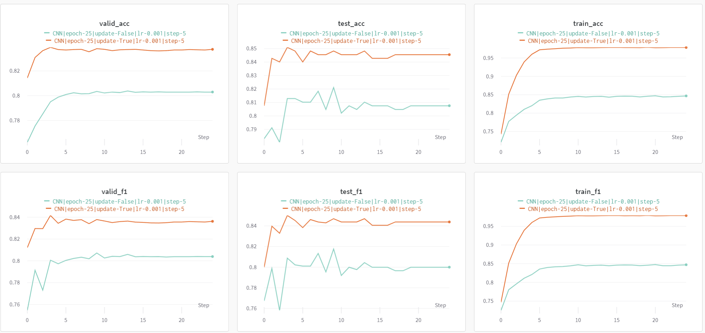
     		<!--换行-->
    

			<!--块级封装-->
    
	<!--将图片和文字居中-->
    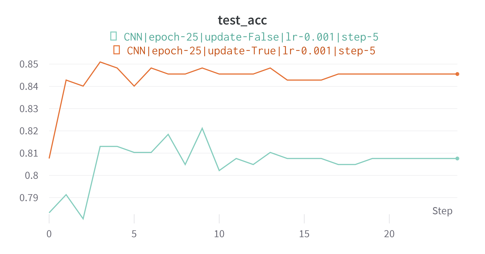
     		<!--换行-->
    

			<!--块级封装-->
    
	<!--将图片和文字居中-->
    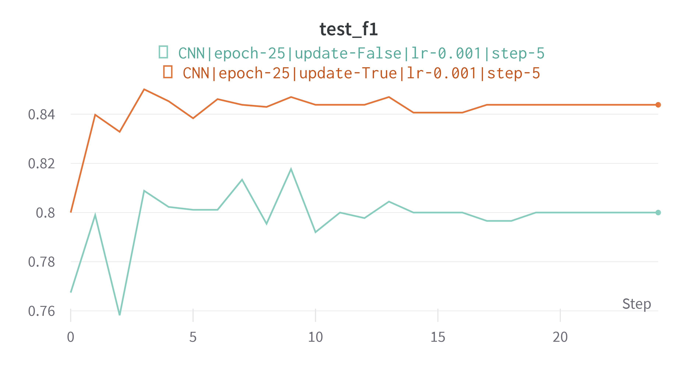
     		<!--换行-->
    

可以看出，更新词向量能明显改进实验效果。这可能是因为更新词向量能使得在训练过程中，词向量能相应地更好拟合训练集。

### 初始学习率

本实验使用的优化器是 `torch.optim.Adam` 优化器，使用 CNN 模型，调整其初始学习率进行测试，结果如下。

			<!--块级封装-->
    
	<!--将图片和文字居中-->
    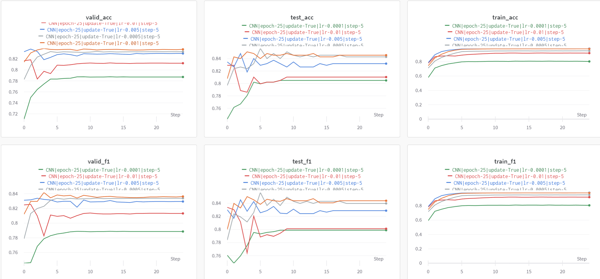
     		<!--换行-->
    

			<!--块级封装-->
    
	<!--将图片和文字居中-->
    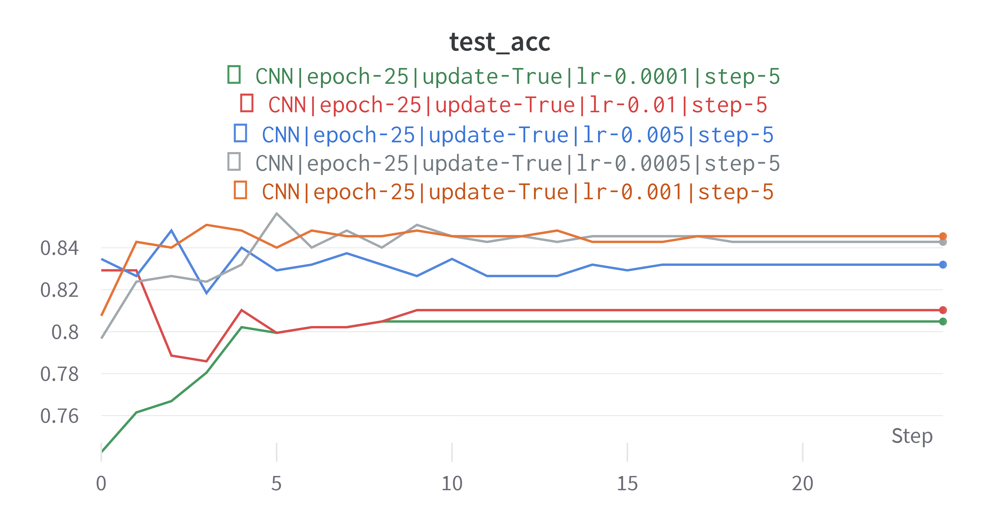
     		<!--换行-->
    

			<!--块级封装-->
    
	<!--将图片和文字居中-->
    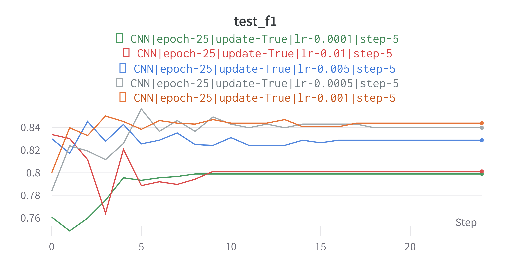
     		<!--换行-->
    

从以上结果可以看出，学习率大约在 0.0005 到 0.001 范围内最佳，因而 `torch.optim.Adam` 优化器的默认学习率 0.001 是较好的值。如果学习率过小，模型更新的速度较慢，导致训练较为缓慢。此外，学习率过小，还可能导致模型陷入局部最优解，而无法找到全局最优解。而如果学习率过大，模型的权重更新过快，可能导致模型无法找到最优解，甚至发散。

### 学习率调整速率

本实验使用了 `torch.optim.lr_scheduler.StepLR` 来调整学习率，在每 `step_size` 个 epoch 之后将学习率乘以 `gamma=0.1` 。改变 `step_size` 的值（即改变学习率的调整速率），仍在 CNN 上实验，结果如下。

			<!--块级封装-->
    
	<!--将图片和文字居中-->
    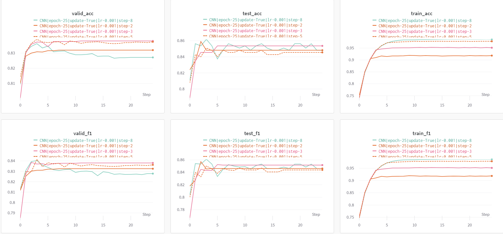
     		<!--换行-->
    

			<!--块级封装-->
    
	<!--将图片和文字居中-->
    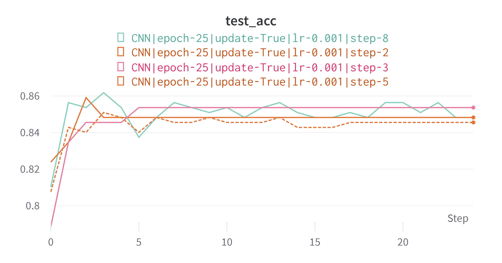
     		<!--换行-->
    

			<!--块级封装-->
    
	<!--将图片和文字居中-->
    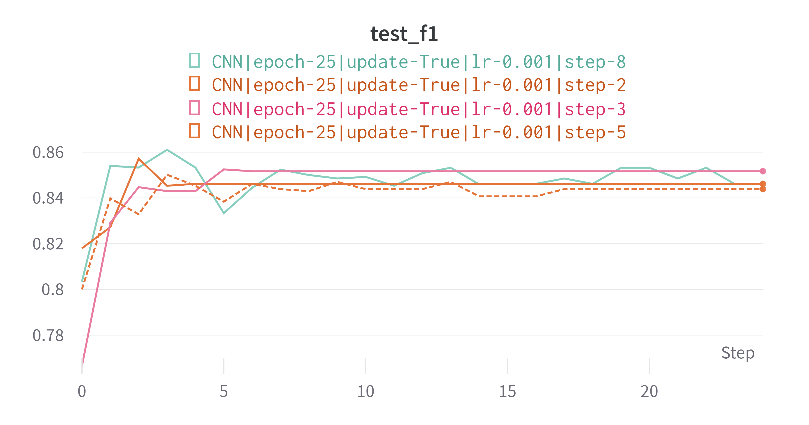
     		<!--换行-->
    

从以上结果可以看出， `step_size` 越小，也即学习率调整越快，那么模型就越快收敛。例如，`step_size = 2` 时，模型在第 3 个 step 就收敛；`step_size = 3` 时，模型在第 5 个 step 收敛；`step_size = 5` 时，模型在第 17 个 step 收敛。如果 `step_size` 太小，可能导致模型的权重太早停滞，此时可能尚未收敛到最佳值；如果 `step_size` 太大，可能导致模型权重持续震荡，不能较快收敛。

### Dropout 丢弃概率

本次实验的 4 个模型都使用了 Dropout 层来随机丢弃一些神经元，从而避免过拟合。调整 Dropout 层的丢弃概率，实验结果如下。

			<!--块级封装-->
    
	<!--将图片和文字居中-->
    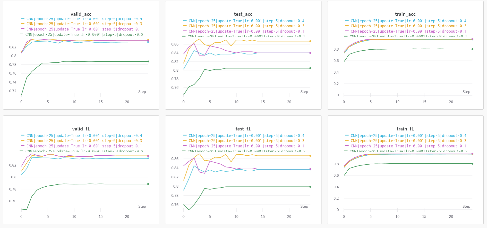
     		<!--换行-->
    

			<!--块级封装-->
    
	<!--将图片和文字居中-->
    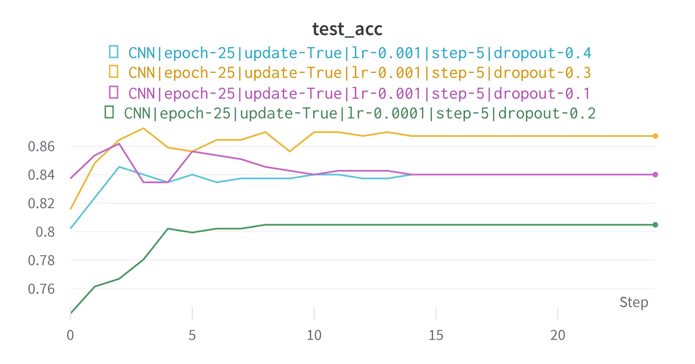
     		<!--换行-->
    

			<!--块级封装-->
    
	<!--将图片和文字居中-->
    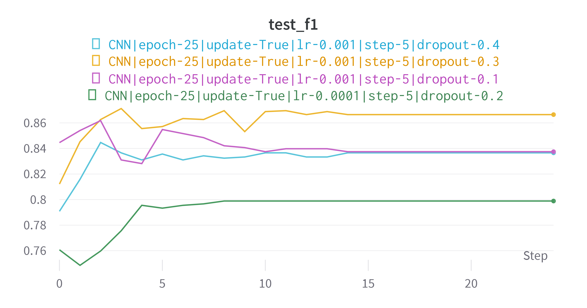
     		<!--换行-->
    

如果 Dropout 概率太小，则接近于没有应用 Dropout，这样容易导致过拟合现象。过拟合会使得模型在训练集上表现良好，但在测试集上表现不佳。例如，从实验结果可以看出，当概率设置为 0.1 时，大约在第 5 个 step 之后，模型在测试集上的表现开始下降，表明可能出现了过拟合。不过，在本次实验中发现，Dropout 设置为 0.2 时的效果比 0.1 和 0.3 都显著下降，其中的原因还有待探究。

如果 Dropout 概率太大，则相当于随机丢弃了过多的神经元，这样会导致模型的效果下降。因为丢弃过多的神经元使得模型无法学习到足够的特征来对数据进行建模。此外，Dropout 概率过大还会导致模型训练过程不稳定，使得模型收敛较慢甚至不收敛。

## 问题思考

### 问题 1

> 实验训练什么时候停止是最合适的？简要陈述你的实现方式，并试分析固定迭代次数与通过验证集调整等方法的优缺点。

在本次实验中，采用了固定迭代次数的方法。训练的 epoch 数可以通过命令行的 `-e` 选项指定，默认为 10 。经过实验发现，在 20 个 epoch 之后，模型在测试集上的表现基本收敛。

观察还发现，在 2-5 个 epoch 后，模型在验证集和测试集上的表现开始下降，所以可以在这个时候停止训练，以节省计算资源，并得到更好的训练结果。若要自动化地选择训练停止的时间，可以在验证集的准确率开始下降（或者上升幅度小于一定阈值）时，就自动停止训练。

优缺点比较：
- 固定迭代次数
  - 优点是容易实现；并且便于找到最优的训练模型。
  - 缺点是不能充分利用数据的信息，无法预先判断模型是否已经收敛。如果固定的迭代次数过少，则可能会导致模型拟合效果不佳；如果固定的迭代次数过多，则可能会导致模型过拟合。此外，若要找到最优的训练模型，往往需要预设一个较大的 epoch 数，但这会浪费额外的训练时间（特别是对于收敛较快的模型而言）。
- 通过验证集调整
  - 优点是可以根据模型动态调整，节约训练时间。
  - 缺点是，由于真实的训练过程中，验证集上的表现会有一定的波动，因而需要设定好合适的阈值，才能判断模型拟合效果何时达到最佳（即过拟合前的临界点）。

### 问题 2

> 实验参数的初始化是怎么做的？不同的方法适合哪些地方？（现有的初始化方法为零均值初始化，高斯分布初始化，正交初始化等）

本次实验用到的 `nn.Conv2d` 和 `nn.Linear` 均采用了均匀分布初始化（即 PyTorch 中这两个模型默认的方法）。

#### 零均值初始化

如果所有权重初始值都是 0 ，那么每个神经元的输出都是相同的，而且所有权重的梯度也相同，因而更新后的参数在每一层内都是相同的，这使得模型无法学习到有用的特征。

如果在所有权重均值为 0 的基础上，加一些随机的噪声（例如较小方差的高斯分布），可以得到其它的**零均值初始化**方法，例如 Xavier 初始化、He 初始化。

Xavier 初始化是一个均匀分布，适合用于线性激活函数（或者近似线性的函数，例如 sigmoid 和 tanh 在 0 附近近似线性）。

He 初始化见下。

### 高斯分布初始化

高斯分布初始化是将权重矩阵中的元素初始化为满足高斯分布的随机数。其中截断正态分布初始化还对高斯分布进行了截断，以避免权重值过大或过小的问题。

其中的 He 初始化（He kaiming 初始化）则是一个均值为 0 的高斯分布，比较适用于（非线性的） ReLU 激活函数。

### 正交初始化

正交初始化的方法是将权重矩阵初始化为正交矩阵。正交初始化的优点是可以防止梯度消失或梯度爆炸问题，使得神经网络更加稳定。它适用于具有多层结构的神经网络，常用于 CNN 和 RNN。

### 问题 3

> 过拟合是深度学习常见的问题，有什么方法可以防止训练过程陷入过拟合？

- 借助验证集，适时停止训练。当模型在验证集上的表现开始下降（或者上升幅度小于一定阈值）的时候，停止训练。
- 临时随机舍弃一些神经元，从而减少模型规模，避免模型陷入过拟合。
- 在损失函数中加入正则化项，通过对模型的复杂程度进行惩罚，以限制模型的复杂性，从而避免过拟合。
- 数据增强。通过对数据集进行细微变化（例如加入噪声），来扩大数据规模，避免因为数据集太小而导致过拟合。
  
### 问题 4

> 试分析 CNN，RNN，全连接神经网络（MLP）三者的优缺点。

- CNN
  - 优点
    - 能提取局部特征
    - 训练较快
    - 相对于全连接神经网络，适用卷积核相当于“共享”了权重，减少了参数规模。
  - 缺点
    - 输入长度固定
    - 对于体现序列类型的数据（例如文本、语音），不能体现数据的前后关联性。
- RNN 
  - 优点
    - 有一定的“记忆”和“遗忘”效果，因而适合用于处理文本（线性序列）以及时间序列相关（例如语音）的问题。
    - 输入长度可变。
  - 缺点
    - 训练较慢。在本次实验中，CNN 和 MLP 的训练时间较为接近（CNN 略多）。而 RNN 大约需要 CNN 的 10 倍训练时间。
    - 容易出现梯度消失和梯度爆炸等问题
- MLP
  - 优点
    - 模型简单，易于实现。
    - 能把握全局的信息和所有特征
  - 缺点
    - 要达到一定效果需要较大的参数规模，导致空间和时间成本上升

## 心得体会

在完成本次实验时，我从零开始学习神经网络框架 PyTorch 的使用。通过本次实验，我既初步了解了 PyTorch 的使用方法，感受到框架给神经网络训练带来的重大便利，也复习了课程中关于 CNN、LSTM、全连接神经网络的知识；更感受到了神经网络这一计算模型的强大威力。

本次实验我还使用了 `wandb` 来可视化地展示实验结果，这让我体会到了使用现有工具对提升效率的显著效果，也让我意识到了掌握这些工具的重要性。

在实验中，我的参数初始化都使用了 PyTorch 的默认初始化。在了解不同的参数初始化方法时，我感受到神经网络的复杂和深奥。
